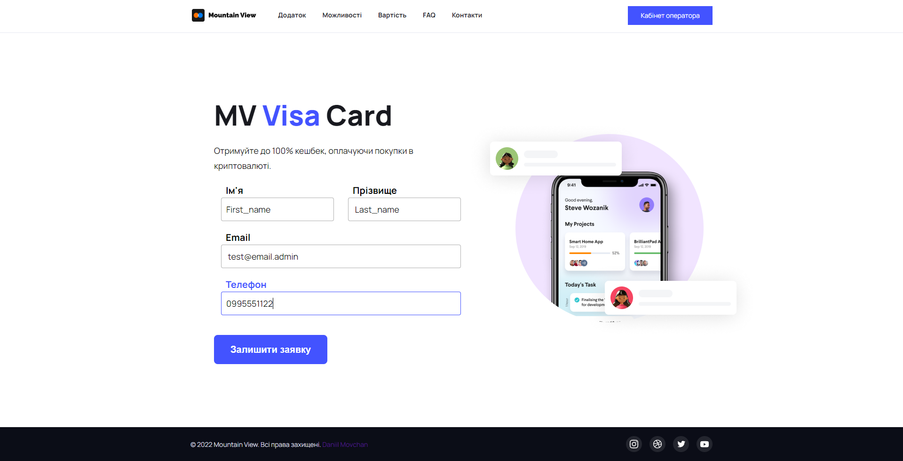

# Queue manager MV VISA card
##### Follow these steps to install

1. Install python
2. Create venv in source root: <code>python -m venv venv </code>
3. Activate venv: <code>.\venv\Scripts\activate</code>
4. Install requirements: <code>python install -r requirements.txt</code>
5. <code>cd mvcard</code>
6. Create superuser: <code>python manage.py createsuperuser</code>
7. Migrate db: <code>python manage.py migrate</code>
8. Run server: <code>python manage.py runserver</code>
9. Congrats!

## Usage Guide
1. Leave an application for the purchase of a bank card
2. If your application with a phone number is no longer pending, you will see [alert submit](img/2.PNG)
3. Else [alert decline](img/3.PNG)
4. Before manage applications, fill out the login form (login admin, password admin) [login page](img/4.png)
5. Then you can accept or decline the [application](img/5.png), as well as view the [history](img/6.png)
6. You can also register or recover your password by email (the letter will be displayed in the application console)

